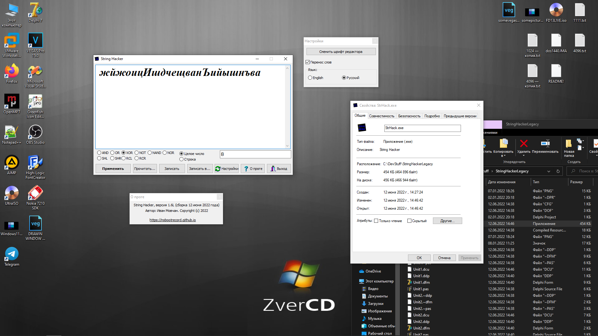

# String Hacker / StrHack

String Hacker (or simply StrHack) is my old cryptographic utility written in pure Delphi 7 (and Visual C++).\

* A lot of mathematical and logical operations (ADD, SUB, XOR, NOT...) supported
* Simple, user-friendly and multi-language user interface
* Portable and lightweight
* Working with text files properly
* and other...

I had been developing this program from October 2021 to May 2022.\
Versions 1.0 - 1.2 were coded in Delphi 7. Versions 1.3 - 1.5 were coded in Visual C++ (sadly, source codes are lost).\
Since June 2022 this project is closed and open-source. You can modify the program, change the copyrights, clone the repository and just enjoy discovering my bullsheet-code :)

-----------------------

String Hacker (или же просто StrHack) - моя старая криптографическая утилита, написанная на Delphi 7 (и Visual C++).\

* Есть поддержка многих математических и логических операций (ADD, SUB, XOR, NOT...)
* Простой, дружелюбный и многоязычный GUI
* Лёгкость и портативность
* Работает с текстовыми файлами
* и многое другое...

Я занимался разработкой этой ~замечательной~ программы с октября 2021 года по май 2022 года.\
Версии 1.0 - 1.2 были написаны на Delphi 7. Версии 1.3 - 1.5 были написаны на Visual C++ (к сожалению, исходные коды утеряны).

С июня 2022 года проект закрыт, а исходные коды открыты для всех. Вы можете делать с программой всё что угодно (даже копирайты можете перебить, мне вообще пофигу). Клонируйте репозиторий, модифицируйте коды, делайте модификации и просто наслаждайтесь этим шедевром 7о8н0кодинга :)

